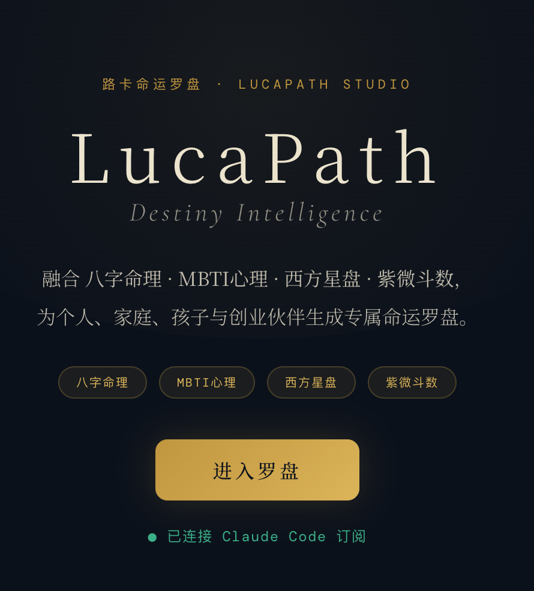
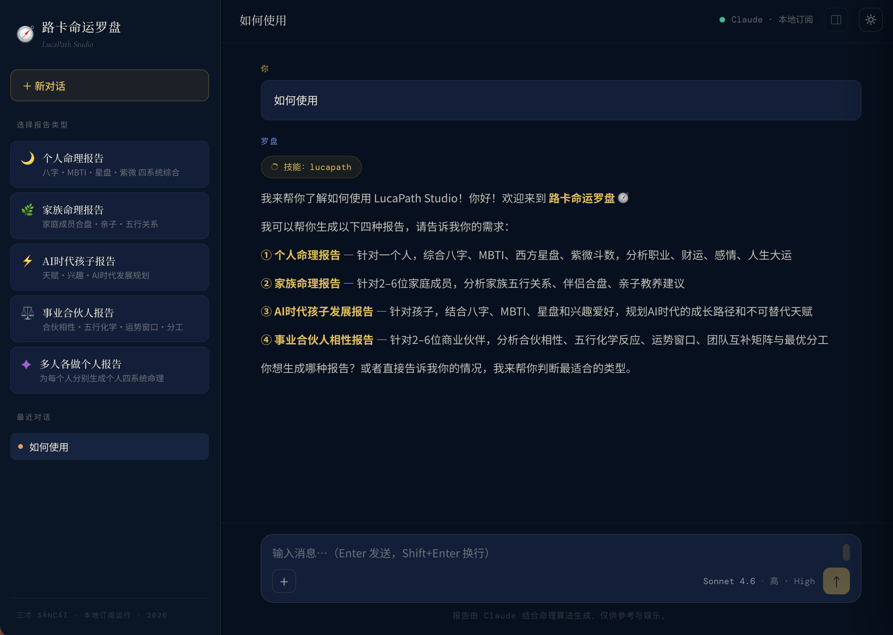
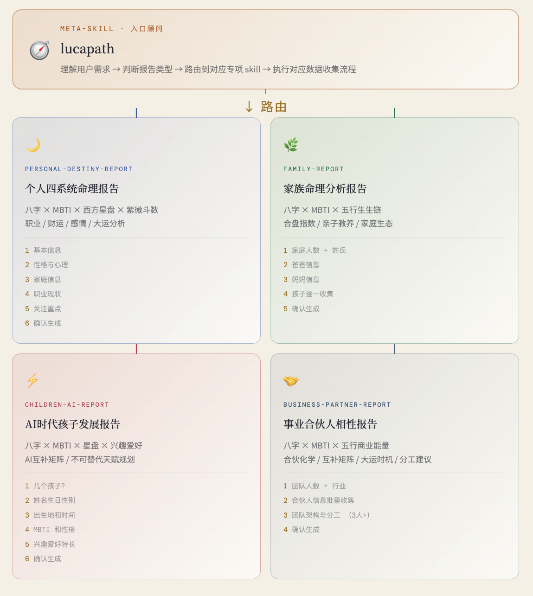
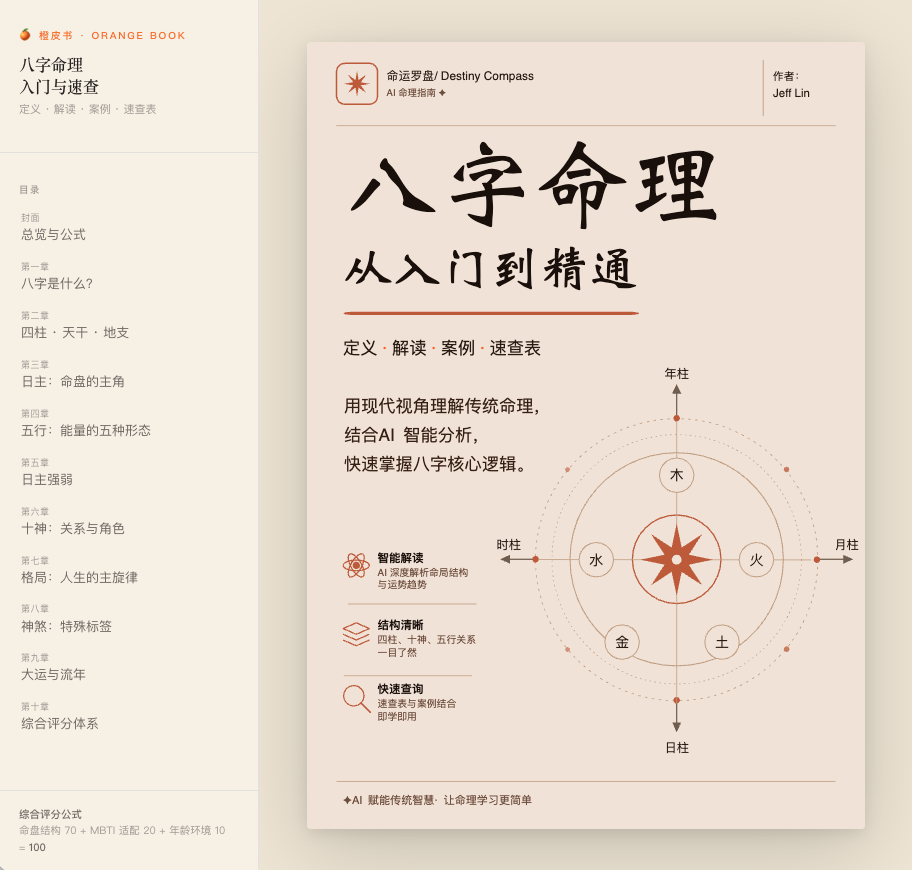

# LucaPath 路卡命运罗盘

Chinese family destiny analysis app — BaZi (八字), Five Elements (五行), MBTI, and Western astrology combined into polished HTML reports for affluent Chinese families navigating child development and life decisions.

## 使用说明

### 第一步：启动 Studio

确保已安装并登录 Claude Code CLI，然后在 `studio/` 目录下启动本地服务：

```bash
cd studio
npm install
npm run dev   # client :3000 · server :8787
```

浏览器打开 `http://localhost:3000`，看到如下落地页即为连接成功：



---

### 第二步：选择报告类型，开始对话

进入 Studio 后，左侧侧边栏列出四种报告类型。直接点击对应类型，或在对话框输入任意需求，罗盘会自动路由到对应的专项 skill：



---

### 第三步：了解 Skill 路由架构

入口 meta-skill `lucapath` 理解用户意图后，自动分发到四个专项 skill。每个 skill 有独立的信息收集流程（3–6 步问答），最终生成一份完整的自包含 HTML 报告：



| Skill | 适用场景 | 系统融合 |
|-------|---------|---------|
| `personal-destiny-report` | 个人命理分析 | 八字 × MBTI × 西方星盘 × 紫微斗数 |
| `family-report` | 家族 / 亲子分析 | 八字 × MBTI × 五行生生链 |
| `children-ai-report` | AI 时代孩子发展规划 | 八字 × MBTI × 星盘 × 兴趣爱好 |
| `business-partner-report` | 创业合伙人相性 | 八字 × MBTI × 五行商业能量 |

---

### 参考：八字命理橙皮书

如需了解八字命理基础知识，可查阅随项目发布的《八字命理入门与速查》橙皮书，内含定义、解读、案例与速查表：



在线阅读：<https://lucalinkai.github.io/lukapath/Publish/bazi_orange_book.html>

---

## Running the Studio

The full Studio (Claude-style chat UI that drives the report skills) lives in `studio/`:

```bash
cd studio
npm install
npm run dev   # client :3000 · server :8787
```

Requires Claude Code CLI installed and logged in. See [`studio/README.md`](studio/README.md) for details.

## Published Pages

Static pages are served from GitHub Pages (`main` branch). Files live in `Publish/`:

| File | Format | Link |
|------|--------|------|
| `bazi_orange_book.html` | HTML | <https://lucalinkai.github.io/lukapath/Publish/bazi_orange_book.html> |
| `bazi_orange_book.epub` | EPUB | [download](https://lucalinkai.github.io/lukapath/Publish/bazi_orange_book.epub) |

Site root: <https://lucalinkai.github.io/lukapath/>

## Skills

Five Claude Code skills live in `.claude/skills/`. Invoke the meta-skill for any report request — it routes to the right specialist automatically.

| Skill | Trigger | Output |
|-------|---------|--------|
| `lucapath` | Any destiny/report request (routes to one of the four below) | — |
| `personal-destiny-report` | 个人四系统报告, 算命报告, 命理分析 | Dark navy/gold HTML — BaZi + MBTI + Western astrology + Zi Wei Dou Shu |
| `family-report` | 家族报告, 亲子分析, 合盘 | Light paper HTML — BaZi + MBTI + Five Elements for 2–6 members |
| `children-ai-report` | AI时代孩子分析, 孩子发展规划 | Dark circuit HTML — BaZi + MBTI + astrology + hobbies → AI-era talent roadmap |
| `business-partner-report` | 合伙人分析, 事业相性, 创业团队 | Slate/cream HTML — BaZi + MBTI + Five Elements → partnership chemistry + timing windows |

### Usage in Claude Code

```
/lucapath
```

Or invoke a specific skill directly, e.g. `/family-report`.

## Importing into Claude Cowork

Download [`dist/lucapath-plugin.plugin`](dist/lucapath-plugin.plugin), then:

1. Open Claude Cowork → left sidebar → **"+"** next to *Personal plugins*
2. Choose **Upload plugin**
3. Select `lucapath-plugin.plugin`

All five skills are now available in Cowork. Invoke them by typing `/lucapath` (or `/personal-destiny-report`, `/family-report`, etc.) in any chat.

---

## Packaging Skills for Distribution

`scripts/pack.py` converts `.claude/skills/` into distributable artifacts with no external dependencies.

```bash
# Generate both .skill archives and the plugin directory (default)
python3 scripts/pack.py

# Only .skill archives
python3 scripts/pack.py --no-plugin

# Only the plugin directory
python3 scripts/pack.py --no-zips

# Custom output directory and plugin name
python3 scripts/pack.py --out ./release --plugin-name my-plugin
```

**Output in `dist/`:**

| Artifact | Format | Use |
|----------|--------|-----|
| `<name>.skill` | ZIP archive | Share / import individual skills |
| `lucapath-plugin/` | Plugin directory | Exploded plugin — inspect or extend |
| `lucapath-plugin.plugin` | ZIP archive | **Upload to Cowork via "Upload plugin"** |

The plugin directory structure:

```
lucapath-plugin/
├── .claude-plugin/
│   └── plugin.json
└── skills/
    ├── lucapath/
    ├── personal-destiny-report/
    ├── family-report/
    ├── children-ai-report/
    └── business-partner-report/
```

Always edit skill source files under `.claude/skills/`, then re-run `pack.py` to refresh `dist/`.

## Reference Files

- `PRD/LucaPath_product_design.html` — personas, feature architecture, pricing, roadmap
- `PRD/sancai_product_design.html` — earlier 三才 branding iteration
- `lucapath_skill_architecture.html` — skill routing diagram
- `Publish/bazi_orange_book.html` — 八字命理橙皮书, BaZi intro & quick-reference handbook (published — see [Published Pages](#published-pages))
- `Publish/bazi_orange_book.epub` — same content as EPUB (generated by `scripts/html_to_epub.py`)
